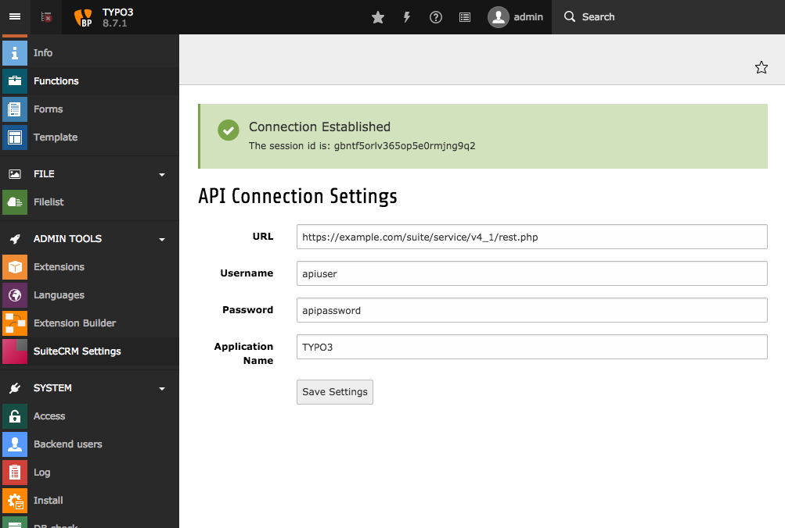
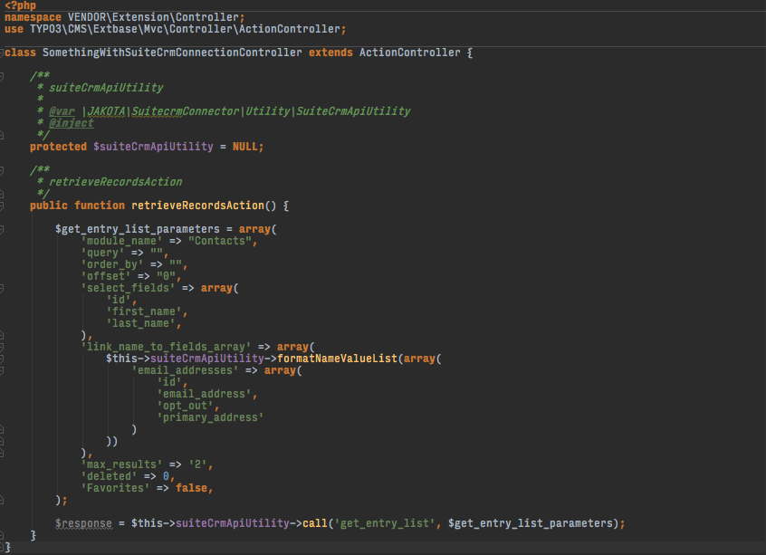

.. ==================================================
.. FOR YOUR INFORMATION
.. --------------------------------------------------
.. -*- coding: utf-8 -*- with BOM.

.. include:: ../Includes.txt

.. _introduction:

Introduction
============

.. _what-it-does:

What does it do?
----------------

This extension provides a backend interface to set up your SuiteCRM API configuration and a class to send API calls.

.. _screenshots:

Screenshots
-----------

   The form to input your api access data in the backend

   Simple example how to load contacts in a Extbase controller.
